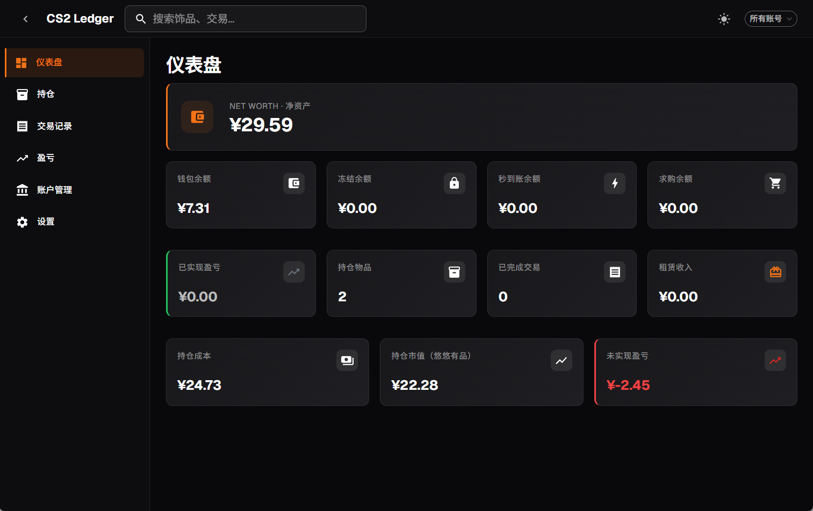
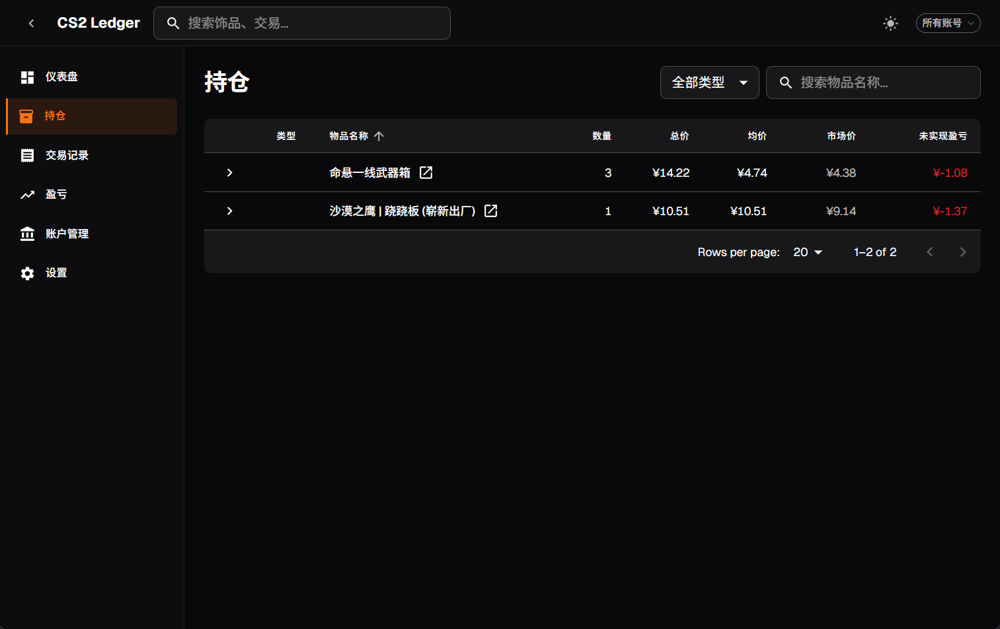
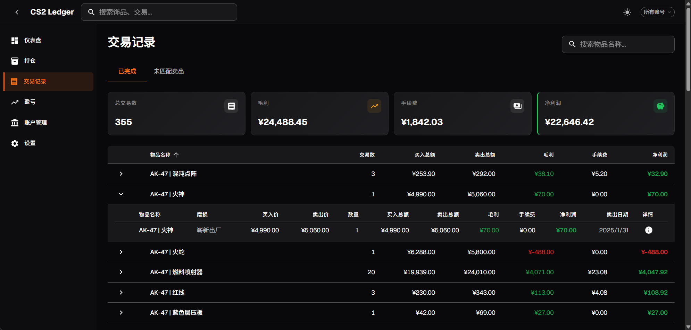
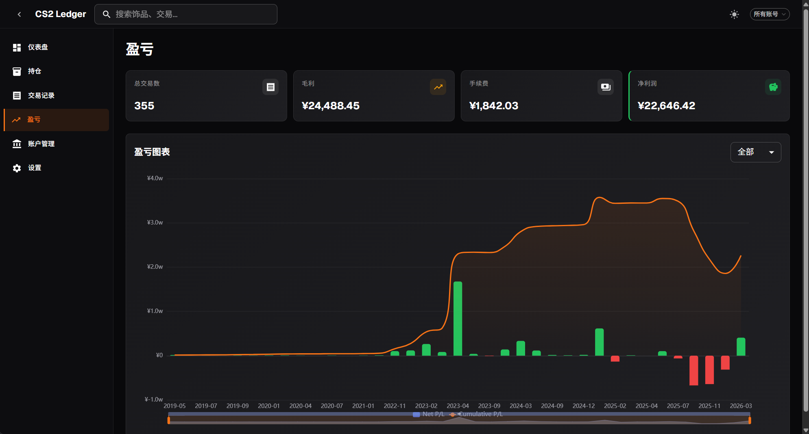
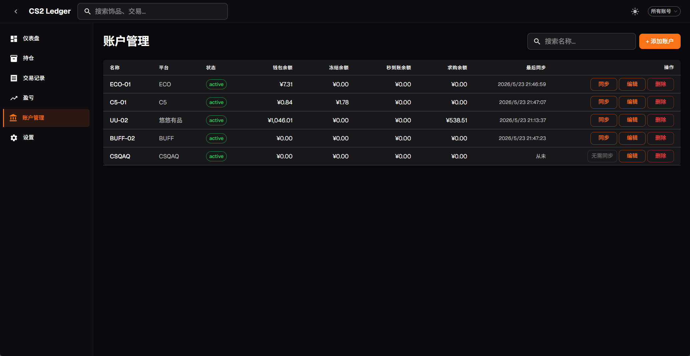

# Examples

## 仪表盘

账户概览：钱包余额、已实现盈亏、持仓市值与未实现盈亏。

## 持仓管理

按物品名称 + 磨损程度分组展示持仓，支持类型筛选、排序、搜索。点击 CSQAQ 图标可直接在浏览器中查看饰品详情。

## 交易记录

已完成交易按物品分组，展示买入均价、卖出均价、已实现盈亏。

## 盈亏分析

按账户查看 P&L 汇总与月度明细。

## 账号管理

